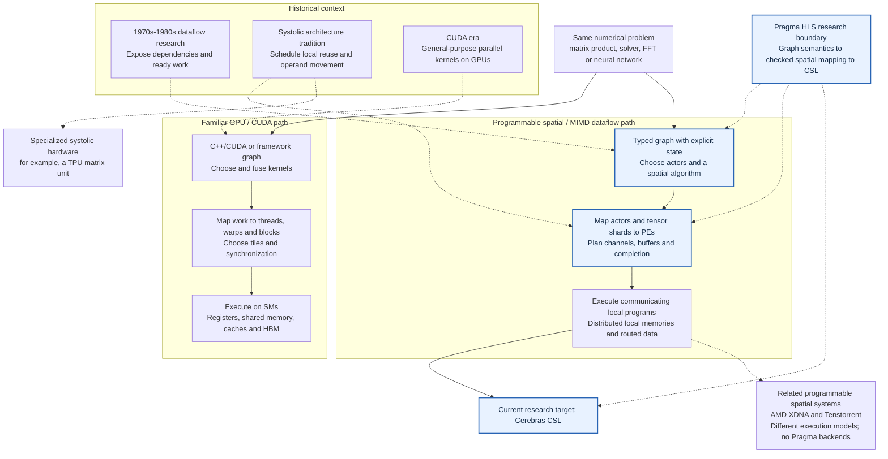
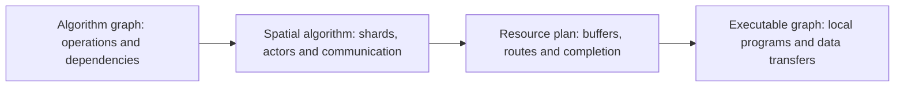
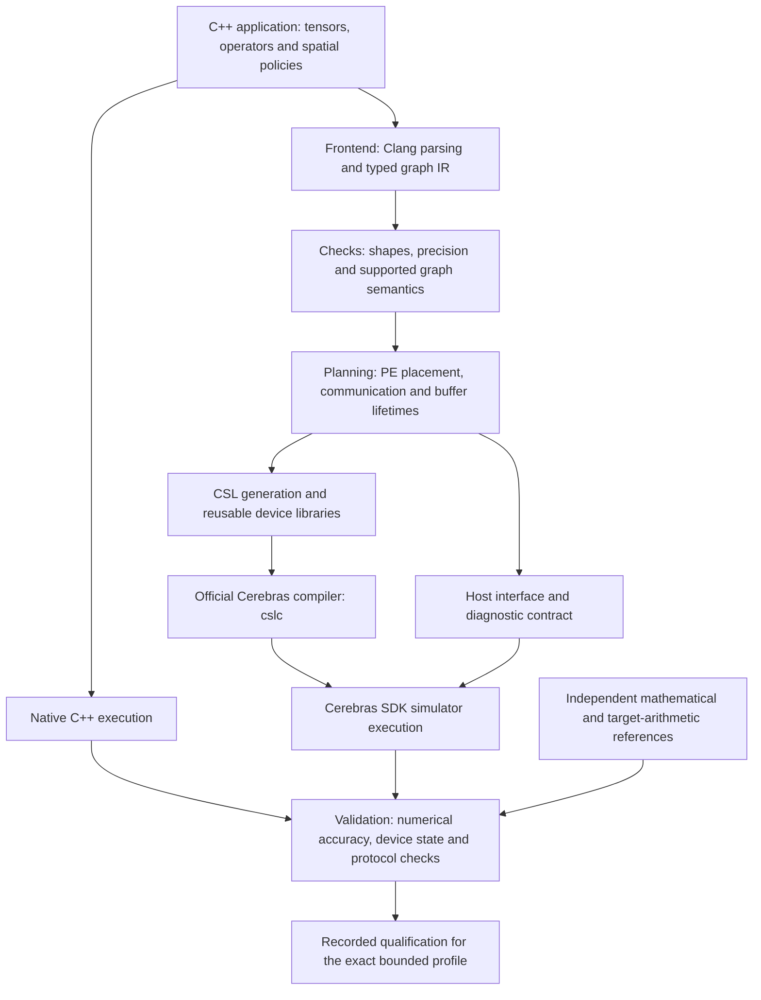

# MIMD Dataflow — Pragma HLS

**How should we program a machine whose many processors hold local state, execute independently and exchange data directly?** This project explores a computation-graph programming model for numerical algorithms on programmable spatial hardware. Pragma HLS is our research implementation: restricted C++ tensor programs, explicit algorithm and placement policies, a typed compiler, and generated Cerebras Software Language (CSL).

The accompanying **[Spatial HLS survey](https://github.com/lingzhi227/dataflow-programming-literatures/blob/main/notes/spatial-hls-survey.pdf)** develops the research basis: invariant-derived algorithms, recurrence localization, transform algebra, finite-resource scheduling and concrete target interfaces. This repository supplies a [bounded supporting prototype and frozen experiment](docs/research/spatial-contracts.md). The survey's broader compiler architecture is proposed work.

[Research background](#from-mimd-and-dataflow-to-spatial-programming) · [Project design](#project-design) · [Repository guide](#where-the-files-fit) · [Development log](#completed-work-newest-first) · [Validation](#how-to-interpret-a-pass)

## From MIMD and dataflow to spatial programming

### A map for CUDA programmers

Read the two paths below as **different mapping responsibilities**, not a claim that GPUs cannot execute graphs or that spatial processors eliminate instruction execution. The dashed arrows show historical ideas relevant to each path, not a complete genealogy.



For a CUDA programmer, the shift is from primarily arranging **threads and memory access within kernel executions** to also arranging **which local programs own state and how values move between them**. Both paths still need tiling, overlap, synchronization and numerical validation. GPUs can use persistent kernels and graph execution; spatial machines can time-multiplex multiple operations on a PE. The diagram describes an emphasis, not a rigid hardware dichotomy.

| Familiar CUDA concern | Question exposed by our spatial graph model |
| --- | --- |
| Thread/block decomposition | Which actor and tensor shard reside on each PE or PE region? |
| Coalescing, shared-memory tiling and reuse | Which values stay local, and which travel over which routes? |
| Synchronization and producer/consumer ordering | Which receive and compute completions make a buffer safe to consume or reuse? |
| Registers/shared-memory limits and occupancy | Do local code/data, queues, routes and concurrent live buffers fit? |
| Kernel fusion and persistent execution | Can adjacent graph stages compose while retaining valid ownership and state? |

These are engineering analogies, not one-to-one mappings: a CUDA thread block is not a Cerebras PE. The NVIDIA and Cerebras references below describe the respective execution models.

### Three related ideas with different meanings

**MIMD (multiple instruction streams, multiple data streams)** describes processors that can execute different instruction streams on different data. It says how execution is organized; it does not, by itself, specify a programming language, shared memory or message passing. Flynn's taxonomy provides the historical vocabulary for this distinction. [Flynn, *Some Computer Organizations and Their Effectiveness*, 1972](https://users.cs.utah.edu/~hari/teaching/paralg/Flynn72.pdf).

**Dataflow** describes computation through dependencies: operations become eligible when their required inputs and execution conditions are available. A graph makes independent work visible; communication carries values between producers and consumers. The classical dataflow research associated with Jack Dennis and Arvind explored this connection between parallel languages and machines through the 1970s and 1980s. Modern spatial systems draw on related ideas without necessarily implementing classical token-matching machines. [MIT, *The Dataflow Model of Computation*](https://www.csail.mit.edu/event/dataflow-model-computation).

**Systolic algorithms** map a computation onto a regular arrangement of processing elements, with a scheduled rhythm of local computation and data movement. Data is reused as it passes through the array. For matrix multiplication, a PE can retain a partial sum while operands arrive from neighboring PEs. The design problem includes both where a recurrence executes and when its operands arrive. Kung's 1982 account emphasizes this systematic mapping and the balance between computation and I/O. A general asynchronous dataflow graph need not be systolic, and a systolic array need not offer independently programmable MIMD processors. [Kung, *Why Systolic Architectures?*](https://www.eecs.harvard.edu/~htk/publication/1982-kung-why-systolic-architecture.pdf).

Here, **MIMD dataflow** names the research direction of combining independently programmable processing elements with explicit dependency-driven communication. It is a design space, not a claim that all hardware below has the same execution model.

### From TensorFlow and PyTorch graphs to a physical execution graph

TensorFlow graphs represent operations and tensors; `tf.function` captures graph execution from Python. PyTorch supports eager execution and graph capture through `torch.compile`, whose frontend extracts operation graphs with guards and may encounter graph breaks. These frameworks demonstrate how a graph can connect a convenient application language to compiler transformations. [TensorFlow graph guide](https://www.tensorflow.org/guide/intro_to_graphs), [PyTorch Dynamo concepts](https://docs.pytorch.org/docs/main/user_guide/torch_compiler/compile/programming_model.dynamo_core_concepts.html).

An application graph still leaves physical questions unanswered: which PE owns each tensor shard, which route carries it, how much buffering is required, and when a producer may overwrite storage. Mapping a graph to spatial hardware therefore needs more than selecting an implementation for each operator. It needs a communication graph, a storage plan and a schedule that preserve the application's semantics together.



This is the compiler boundary Pragma investigates. A future frontend might accept framework graphs, but the current project starts from restricted C++; it is not an implemented TensorFlow or PyTorch backend.

### Why examine alternatives to GPU execution?

GPUs are highly effective for dense parallel work and have mature libraries and compilers. Their execution and memory organization nevertheless shape algorithm design: divergent paths within a warp can reduce useful parallelism; memory access patterns affect transfer efficiency; finite local storage limits reuse; and moving intermediate results or coordinating separate stages can become expensive. Modern GPU techniques can reduce these costs, so none of these observations establishes that dataflow hardware will always be faster. [NVIDIA CUDA programming guide](https://docs.nvidia.com/cuda/cuda-programming-guide/).

Our research question is whether suitable computations can benefit from persistent local state, producer-to-consumer transfers and independently progressing regions of a spatial machine. The tradeoff is explicit: distributed memory introduces placement constraints, limited routes, backpressure, load imbalance and difficult completion conditions. Performance depends on the algorithm, problem size, numerical policy and mapping. This repository's simulator qualifications establish bounded correctness, not a GPU speedup.

### Contemporary hardware: different ways to exploit locality and data movement

| Architecture | Relevant organization | What its programming model teaches us |
| --- | --- | --- |
| **FPGA** | Reconfigurable logic can implement specialized pipelines and networks of communicating tasks. | HLS must turn operations into concurrent hardware with explicit channels and finite buffering. AMD Vitis distinguishes control-driven and data-driven task parallelism. [Vitis tasks and channels](https://docs.amd.com/r/en-US/ug1399-vitis-hls/Tasks-and-Channels) |
| **Google TPU** | Matrix-multiply units use systolic arrays, alongside vector and scalar units. | Regular matrix data reuse can be realized in specialized hardware; a systolic matrix unit is not a general CSL-like programmable PE mesh. [TPU architecture](https://docs.cloud.google.com/tpu/docs/system-architecture-tpu-vm) |
| **Cerebras WSE** | A two-dimensional mesh of PEs with local memory, independent programs and message-based communication. | Local computation and inter-PE protocols can be programmed together. This is Pragma's current target. [WSE architecture](https://sdk.cerebras.ai/computing-with-cerebras) |
| **AMD XDNA** | A spatial dataflow array of AI Engine tiles with scalar/vector processing and local memories. | Tile programs and communication placement are central; SIMD execution inside a tile can coexist with spatial dataflow across tiles. [XDNA architecture](https://www.amd.com/en/technologies/xdna.html) |
| **Tenstorrent Tensix** | Programmable cores coordinate data movement and matrix/vector compute engines. | Compute, unpacking/packing and data transport require coordinated pipelines. [Tensix compute and dataflow](https://docs.tenstorrent.com/tt-metal/latest/tt-metalium/tt_metal/advanced_topics/compute_engines_and_dataflow_within_tensix.html) |

These are comparison points for programming-model research. Pragma currently has no FPGA, TPU, XDNA or Tenstorrent backend.

### CSL and the programming model we want to explore

Cerebras exposes PE programs, task activation, routes and message transfer through CSL, with Python host code for loading, launching and transferring data. Each PE owns local memory; another PE accesses the data through communication rather than ordinary shared-memory loads. This provides a concrete substrate for experimenting with spatial algorithms. [Cerebras programming model](https://sdk.cerebras.ai/computing-with-cerebras).

Our proposed higher-level model should let a programmer express **the mathematical graph, its state and its intended spatial algorithm**, while the compiler checks and implements the corresponding communication and storage contracts. For example, requesting a reduction should carry its shape, precision and completion semantics—not merely a function name. A stateful graph also needs explicit iteration boundaries, initialization and reset behavior.

The longer-term research agenda is a general numerical graph model with typed tensor and stream edges, persistent actors, bounded feedback, interchangeable algorithm schedules, and composable resource ownership. It should allow expert CSL kernels where needed and expose meaningful mapping choices rather than hide every hardware constraint. These are proposed requirements, not a finished universal language or an established cross-vendor standard.

**Pragma HLS is an experimental vehicle for defining and testing that model.** Here “HLS” means lowering a higher-level numerical description into CSL programs for existing hardware; this project does not synthesize a new FPGA circuit. The current compiler supports a finite collection of graph patterns and explicit policies. Its reusable contributions include typed graph checks, numerical contracts, selected spatial lowerings, resource/lifetime analysis, CSL libraries and reproducible validation.

### Algorithm design: turning equations into local work and communication

Consider `C = A × B`. The equation does not determine a spatial implementation. A SUMMA mapping distributes matrix tiles and broadcasts panels along rows and columns. A Cannon mapping skews tiles and then shifts operands cyclically. A systolic recurrence can keep partial sums local while operand streams move on a regular schedule. The mappings differ in communication, buffering and accumulation order even when they compute the same mathematical result. Pragma preserves that distinction through explicit supported policies and separate source/protocol evidence. [Architecture and numerical contracts](docs/ARCHITECTURE.md).

The following families connect existing Cerebras/CSL algorithm work to the bounded mappings examined in this repository. Upstream implementations and Pragma qualifications are distinct; source provenance is retained in [third-party notices](THIRD_PARTY_NOTICES.md) and each profile's contract.

| Algorithm family | Spatial design problem | Published Pragma scope |
| --- | --- | --- |
| **GEMV and GEMM** | Partition operands, retain partial results, broadcast or shift tiles, and reduce contributions. | Distributed GEMV, SUMMA, Cannon and half two-hop contraction profiles; exact shapes and policies are bounded. |
| **Cholesky, LU and QR** | Schedule factorization dependencies, propagate pivots or rotation coefficients, and update local tiles. | Distributed Cholesky, no-pivot LU and Givens QR; input restrictions and output contracts apply. |
| **Sparse SpMV, DOT and Norm** | Route sparse contributions, handle uneven/empty partitions and combine distributed reductions. | Bounded sparse storage and reduction profiles with numerical/state checks. |
| **CG, Jacobi-PCG and BiCGStab** | Compose SpMV, reductions and vector updates with persistent iteration state and termination rules. | Bounded resident solvers; passing these profiles does not establish every upstream solver schedule. |
| **FFT** | Combine local transforms with distributed data rearrangement and synchronization. | Local and distributed transform profiles, including bounded 3D FFT layouts. |
| **Stencil and application fragments** | Reuse neighboring values and organize repeated field updates or state transitions. | Selected scalar expressions and fragments only; a complete distributed time-stepping application is not established. |
| **Attention and FFN** | Combine contractions, normalization, activation, reductions and cache-related inputs while managing intermediate lifetimes. | Bounded resident subgraphs; complete decoder/model support is not established. |

For sizes, precision, accepted evidence and exceptions, use the [complete qualification index](validation/STATUS.md). An algorithm name alone is not a completion standard.

### LLM execution on Cerebras

An LLM brings these issues together. Prefill processes many input tokens and can exploit matrix-matrix work. Low-batch autoregressive decoding repeatedly applies model weights to new activations, making matrix-vector work and data movement central. Attention additionally reads request-specific history, while normalization and projections require reductions and transformations of distributed tensors. WaferLLM studies wafer-scale mappings and introduces MeshGEMM/MeshGEMV designs for this setting. [WaferLLM, OSDI 2025](https://www.usenix.org/system/files/osdi25-he.pdf).

Cerebras has described an inference design that places weights in on-chip SRAM and partitions larger models across systems at layer boundaries. That is a system-level execution strategy; it does not establish that an arbitrary model fits one wafer or that every request's KV cache remains there indefinitely. [Cerebras inference architecture](https://www.cerebras.ai/blog/introducing-cerebras-inference-ai-at-instant-speed).

For our compiler research, the important unit is a composed graph with explicit ownership: projections produce Q/K/V, attention consumes the appropriate history, and output/FFN stages reuse storage only after prior consumers finish. The Pragma snapshot qualifies several such bounded pieces, including a supplied-cache attention graph whose old cache is read-only. It does not yet establish cache append, complete head/position/mask semantics or full-model inference. Separate CSL model implementations in [csl-llm](https://github.com/lingzhi227/csl-llm) and [csl-llm-sdk](https://github.com/lingzhi227/csl-llm-sdk) maintain their own evidence and do not automatically qualify an HLS lowering.

### How more algorithms could become programmable

Future extensions should start from a precise equation and dependency structure, then identify a spatial algorithm that fits local memory and communication resources. Regular recurrences may suit systolic schedules; irregular sparse or graph workloads may need data-driven actors, load balancing and explicit queue bounds. Neither approach removes the need for numerical and protocol validation.

Our proposed path is to define a typed operator/state contract; choose and analyze the placement and communication schedule; implement or reuse CSL kernels; validate independent mathematics, repeated execution and failure cases; and then test composition under shared resource limits. Candidate domains include fuller PDE/stencil solvers, additional sparse methods and irregular graph algorithms. Automatic mapping search, broader graph frontends and cross-wafer composition remain research directions. This roadmap does not change the current development authorization or claim completed implementations.

## Published implementation at a glance

This repository contains the HLS interfaces, compiler, reusable CSL runtime, algorithm profiles and recorded validation evidence. **The published September 8, 2026 implementation snapshot records 141 SDK-qualified bounded profiles.** A profile is one specified combination of algorithm, dimensions, precision and execution policy. The 35-node attention-plus-FFN candidate is not SDK-qualified in that snapshot. The research overview was expanded on September 10; it does not advance the implementation's validation boundary. [Detailed status](docs/STATUS.md).

## Project design



The compiler handles a finite set of supported operations and graph patterns. It lowers them into PE-local computation, routes and synchronization with explicit resource contracts. Qualified resident compositions keep intermediate tensors on the device between their operators. Arbitrary C++, arbitrary graph composition and a production LLM serving system are outside the demonstrated scope.

The compiler and host orchestration are principally Python; user programs and native checks use C++; device execution uses CSL. Generated CSL is produced in build bundles, so browsing only checked-in `.csl` files does not reveal every supported algorithm. The layout borrows compiler organization conventions from MLIR; this project does not implement MLIR dialects. See [architecture](docs/ARCHITECTURE.md) and [compiler implementation](lib/README.md).

## Where the files fit

| Location | What you will find | Start here when… |
| --- | --- | --- |
| [include/pragma/](include/pragma/) | Public C++ tensor interfaces and HLS annotations | Reading or writing a supported HLS program |
| [lib/](lib/README.md) | Frontend, typed IR, analyses, transformations, CSL lowering, SDK bindings, numerical references and diagnostics | Studying how the compiler works |
| [runtime/csl/](runtime/csl/) | Reusable device math, communication, layouts and PE controllers | Studying actual CSL implementation |
| [runtime/native/](runtime/native/) | C++ support for host execution of HLS programs | Understanding the native reference path |
| [tools/](tools/README.md) | Compile, run-profile and inspect entry points | Using the toolchain |
| [examples/](examples/README.md) | Tutorials and selected generated CSL for reading | Learning the input-to-output workflow |
| [benchmarks/](benchmarks/README.md) | Algorithm profiles grouped into linear algebra, inference, transforms, stencil and applications | Finding an algorithm's `hls.cpp` and `PORT.json` contract |
| [tests/](tests/README.md) | Unit tests, historical numerical fixtures and SDK probes | Investigating a regression or an edge case |
| [validation/](validation/README.md) | Captured profile index and compact historical reports | Checking the evidence behind a result |
| [docs/](docs/REPOSITORY-LAYOUT.md) | Architecture, reproduction instructions and numerical/resource contracts | Understanding design decisions and restrictions |
| [experiments/](experiments/) | Research probes and source comparisons | Examining an investigated behavior; qualification varies |
| [third_party/](third_party/README.md) | Preserved upstream sources and reference extracts | Checking provenance and comparison baselines |
| [archive/](archive/README.md) | Original development chronology | Reading detailed historical work notes |
| [release/](release/SELECTION.md) | Publication selection, file hashes, migration audit and release checks | Auditing this packaged snapshot |
| [scripts/authoring/](scripts/authoring/) | Profile-authoring utilities | Maintaining benchmark definitions |
| `build/` (generated, ignored) | Fresh execution bundles, emitted CSL and run reports | Inspecting your own local build |

The [layout map](hls-layout.json) resolves stable profile keys to their current directories. Preserved reports can refer to historical paths; those paths describe the original run, not files promised to exist in this checkout.

## Completed work, newest first

Dates below follow the recorded qualification identifiers or publication history. Rows group related work; the [complete 141-profile index](validation/STATUS.md) links each profile to its contract and original report. These are records of the published snapshot, not a live development dashboard.

| Date | Completed milestone | Evidence and limits |
| --- | --- | --- |
| 2026-09-10 | Added the survey's finite event-protocol IR, exhaustive interleaving checker and exact mapping/FFT witnesses; completed one bounded SUMMA SDK run. | [Research note and frozen evidence](docs/research/spatial-contracts.md): 131-state/202-transition normal protocol, intentional unsafe/deadlock witnesses, and 16,384 final plus 65,536 intermediate SDK observations for the supplied batches. Existing CSL generation reused; no full-catalogue or cross-backend claim. |
| 2026-09-10 | Expanded the research background and CUDA-to-spatial comparison; organized design, repository guide and reverse-chronological evidence. | Documentation update only; no new algorithm qualification or simulator execution. |
| 2026-09-08 | Separated compiler, runtime, tools, benchmarks and validation into the current directory structure. | [Refactor checks](release/CHECKS.md): 338 regression tests; 4,168 moved files retained identical Git blobs. Selected code-generation comparisons cover MLP and the 25-/35-node graphs. No fresh SDK runs for the refactor. |
| 2026-09-08 | Qualified a 25-node resident normalized-QKV, pair-transform and supplied-cache attention/output/residual composition. | [SDK report](validation/evidence/qualification-20260908T011119829595Z.json): eight-call qualification. New K/V are outputs; the supplied old cache stays read-only. No cache append, masks or head/GQA selection. |
| 2026-09-07 | Qualified batch-major adjacent-pair rotation with an explicit repair for a source DSD offset-reset defect. | [SDK report](validation/evidence/qualification-20260907T232229262682Z.json): six matched SDK/source calls; original failure retained. Coefficients are supplied; automatic position generation is not established. |
| 2026-09-07 | Qualified supplied-cache attention, output projection and residual addition. | [SDK report](validation/evidence/qualification-20260907T225536946434Z.json): eight-call qualification; no cache update or full decoder claim. |
| 2026-09-07 | Qualified a resident batched feed-forward network (FFN), including normalization, UP/GATE projections, activation and DOWN projection. | [SDK report](validation/evidence/qualification-20260907T210527940077Z.json): eight calls; explicit local half arithmetic and f32 collectives. |
| 2026-09-07 | Qualified batched RMS normalization, normalized QKV and normalized UP/GATE subgraphs. | [RMS report](validation/evidence/qualification-20260907T161741173353Z.json), [QKV report](validation/evidence/qualification-20260907T182741945418Z.json), [UP/GATE report](validation/evidence/qualification-20260907T185614692044Z.json). Bounded decode-layout components. |
| 2026-09-07 | Qualified mixed-precision input attention and progressively larger resident attention/FFN tails. | [Mixed-attention report](validation/evidence/qualification-20260907T152814610270Z.json) and [profile index](validation/STATUS.md). Includes normalized FFN, 17-node output tails and 23-node supplied-Q/K/V attention tails; single-head, unmasked scope. |
| 2026-09-07 | Qualified resident attention, gated MLP and projection/residual/RMS graphs; added blocked half accumulation with f32 merging for larger MLP cases. | [Attention report](validation/evidence/qualification-20260907T035216748909Z.json), [blocked MLP report](validation/evidence/qualification-20260907T072500004338Z.json), [projection report](validation/evidence/qualification-20260907T074658560657Z.json). Precision policies and earlier numerical failures remain explicit. |
| 2026-09-07 | Published the first curated Pragma implementation with 122 recorded qualified profiles. | [Initial publication](https://github.com/lingzhi227/MIMD_dataflow/commit/063da29) and [release checks](release/CHECKS-20260907.md). Later additions bring the captured count to 141. |
| 2026-09-06 | Qualified distributed matrix products, factorizations, sparse products, reductions and iterative solvers, plus source-distinct Cannon and half two-hop contraction profiles. | [Profile index](validation/STATUS.md): GEMV, SUMMA/GEMM, Cholesky, no-pivot LU, Givens QR, SpMV, DOT/Norm, CG, Jacobi-PCG, BiCGStab and power iteration. Each has its own size, input and output restrictions. |

The broader catalog also includes FFT, elementary inference operators and limited stencil/application fragments. Use the [benchmark map](benchmarks/README.md) to find their sources and the [qualification index](validation/STATUS.md) to determine what actually passed. Directory presence alone is not proof of completion.

## What remains unproven in this snapshot

The **35-node attention-plus-FFN graph** has native checks and successful CSL compilation, but its full SDK qualification was still pending at the captured checkpoint. Its implementation introduces mean-statistic RMS normalization, caller-owned region composition and a 23-phase storage plan. Primitive successes do not qualify this combined graph. [Candidate source](benchmarks/inference/waferllm/projected_cache_ffn_3x256x512x512_16x16/hls.cpp) · [status and retained failures](docs/STATUS.md).

The published work does not establish full cache append/update, automatic position semantics, head/GQA selection, a complete real-weight LLM or physical-wafer performance. The separately published [CSL-LLM project](https://github.com/lingzhi227/csl-llm) has its own implementation and evidence; its results must not be counted as Pragma HLS qualifications.

The historical development scope was to complete and audit category 8 (WaferLLM numerical stages and accepted compositions), then stop before categories 9–12. This README describes the captured release and does not imply that experiments are currently running or that category 8 is closed.

## How to interpret a pass

A bounded qualification requires supported frontend semantics, native execution, generated CSL compilation, completed SDK calls, independent numerical checks and the profile's device-state/source/protocol gates. Repeated-call and mutation checks apply where required by that contract. **Generating CSL or compiling it is not a numerical SDK pass.**

Historical SDK validation and compiler-version matching are separate facts. In raw evidence, `current_toolchain=false` means the run used a different toolchain snapshot; it does not mean that the run failed. Conversely, a historical pass does not prove that all profiles pass again with the current release. [Full validation policy](docs/VALIDATION.md).

## Reproduce a bounded profile

Use Python 3.10–3.13, the pinned NumPy dependency and a Clang compiler supporting C++17 and `_Float16`. Set `HLS_CLANGXX` if needed.

```sh
python3 -m venv .venv
. .venv/bin/activate
python -m pip install -r requirements.txt
python tools/run_profiles.py --select-exact waferllm/mlp_128x128x512_8x8_blocked
```

This runs native/profile checks and generates a frozen CSL bundle. To execute it in the SDK simulator, configure the external SDK 2.10.1 installation and use the documented `--sdk` workflow. See [reproduction instructions](docs/REPRODUCING.md) for dependencies and execution details. SDK binaries and full historical experiment bundles are not included.

This is an independent research project. See [third-party notices](THIRD_PARTY_NOTICES.md) for upstream provenance; no upstream endorsement is claimed.
