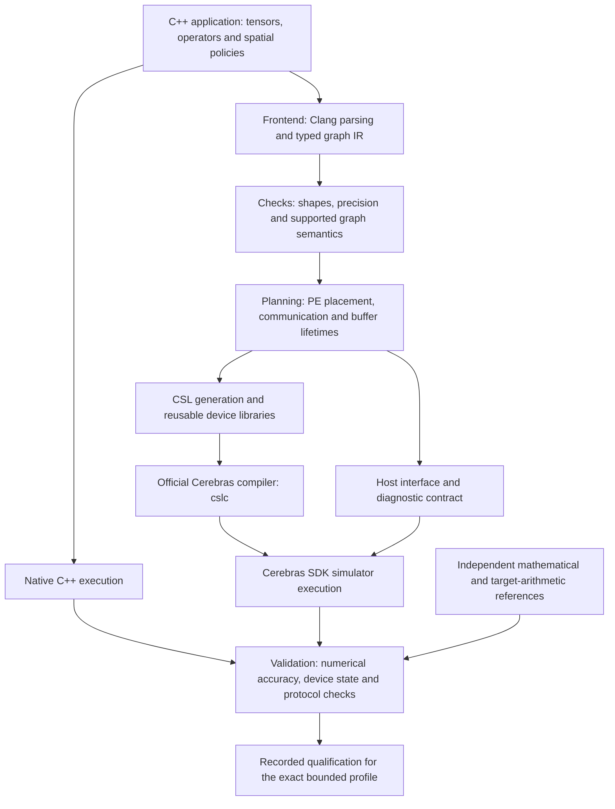

# Pragma HLS

**Pragma is a research compiler that turns restricted C++ tensor programs into explicit spatial dataflow programs in Cerebras Software Language (CSL).** Its purpose is to make numerical algorithms easier to express while retaining control over processing-element (PE) placement, communication, precision and device memory. The official Cerebras compiler and SDK compile and execute the emitted CSL.

This repository contains the HLS interfaces, compiler, reusable CSL runtime, algorithm profiles and recorded validation evidence. **The published September 8, 2026 snapshot records 141 SDK-qualified bounded profiles.** A profile is one specified combination of algorithm, dimensions, precision and execution policy—not a complete general-purpose algorithm library. The 35-node attention-plus-FFN candidate is not SDK-qualified in this snapshot. [Detailed status](docs/STATUS.md).

## Project design



The compiler handles a finite set of supported operations and graph patterns. It lowers them into PE-local computation, routes and synchronization with explicit resource contracts. Qualified resident compositions keep intermediate tensors on the device between their operators. Arbitrary C++, arbitrary graph composition and a production LLM serving system are outside the demonstrated scope.

The compiler and host orchestration are principally Python; user programs and native checks use C++; device execution uses CSL. Generated CSL is produced in build bundles, so browsing only checked-in `.csl` files does not reveal every supported algorithm. The layout borrows compiler organization conventions from MLIR; this project does not implement MLIR dialects. See [architecture](docs/ARCHITECTURE.md) and [compiler implementation](lib/README.md).

## Where the files fit

| Location | What you will find | Start here when… |
| --- | --- | --- |
| [include/pragma/](include/pragma/) | Public C++ tensor interfaces and HLS annotations | Reading or writing a supported HLS program |
| [lib/](lib/README.md) | Frontend, typed IR, analyses, transformations, CSL lowering, SDK bindings, numerical references and diagnostics | Studying how the compiler works |
| [runtime/csl/](runtime/csl/) | Reusable device math, communication, layouts and PE controllers | Studying actual CSL implementation |
| [runtime/native/](runtime/native/) | C++ support for host execution of HLS programs | Understanding the native reference path |
| [tools/](tools/README.md) | Compile, run-profile and inspect entry points | Using the toolchain |
| [examples/](examples/README.md) | Tutorials and selected generated CSL for reading | Learning the input-to-output workflow |
| [benchmarks/](benchmarks/README.md) | Algorithm profiles grouped into linear algebra, inference, transforms, stencil and applications | Finding an algorithm's `hls.cpp` and `PORT.json` contract |
| [tests/](tests/README.md) | Unit tests, historical numerical fixtures and SDK probes | Investigating a regression or an edge case |
| [validation/](validation/README.md) | Captured profile index and compact historical reports | Checking the evidence behind a result |
| [docs/](docs/REPOSITORY-LAYOUT.md) | Architecture, reproduction instructions and numerical/resource contracts | Understanding design decisions and restrictions |
| [experiments/](experiments/) | Research probes and source comparisons | Examining an investigated behavior; qualification varies |
| [third_party/](third_party/README.md) | Preserved upstream sources and reference extracts | Checking provenance and comparison baselines |
| [archive/](archive/README.md) | Original development chronology | Reading detailed historical work notes |
| [release/](release/SELECTION.md) | Publication selection, file hashes, migration audit and release checks | Auditing this packaged snapshot |
| [scripts/authoring/](scripts/authoring/) | Profile-authoring utilities | Maintaining benchmark definitions |
| `build/` (generated, ignored) | Fresh execution bundles, emitted CSL and run reports | Inspecting your own local build |

The [layout map](hls-layout.json) resolves stable profile keys to their current directories. Preserved reports can refer to historical paths; those paths describe the original run, not files promised to exist in this checkout.

## Completed work, newest first

Dates below follow the recorded qualification identifiers or publication history. Rows group related work; the [complete 141-profile index](validation/STATUS.md) links each profile to its contract and original report. These are records of the published snapshot, not a live development dashboard.

| Date | Completed milestone | Evidence and limits |
| --- | --- | --- |
| 2026-09-10 | Reorganized this research overview around design, chronology and a source/evidence map. | Documentation update only; no new algorithm qualification or simulator execution. |
| 2026-09-08 | Separated compiler, runtime, tools, benchmarks and validation into the current directory structure. | [Refactor checks](release/CHECKS.md): 338 regression tests; 4,168 moved files retained identical Git blobs. Selected code-generation comparisons cover MLP and the 25-/35-node graphs. No fresh SDK runs for the refactor. |
| 2026-09-08 | Qualified a 25-node resident normalized-QKV, pair-transform and supplied-cache attention/output/residual composition. | [SDK report](validation/evidence/qualification-20260908T011119829595Z.json): eight-call qualification. New K/V are outputs; the supplied old cache stays read-only. No cache append, masks or head/GQA selection. |
| 2026-09-07 | Qualified batch-major adjacent-pair rotation with an explicit repair for a source DSD offset-reset defect. | [SDK report](validation/evidence/qualification-20260907T232229262682Z.json): six matched SDK/source calls; original failure retained. Coefficients are supplied; automatic position generation is not established. |
| 2026-09-07 | Qualified supplied-cache attention, output projection and residual addition. | [SDK report](validation/evidence/qualification-20260907T225536946434Z.json): eight-call qualification; no cache update or full decoder claim. |
| 2026-09-07 | Qualified a resident batched feed-forward network (FFN), including normalization, UP/GATE projections, activation and DOWN projection. | [SDK report](validation/evidence/qualification-20260907T210527940077Z.json): eight calls; explicit local half arithmetic and f32 collectives. |
| 2026-09-07 | Qualified batched RMS normalization, normalized QKV and normalized UP/GATE subgraphs. | [RMS report](validation/evidence/qualification-20260907T161741173353Z.json), [QKV report](validation/evidence/qualification-20260907T182741945418Z.json), [UP/GATE report](validation/evidence/qualification-20260907T185614692044Z.json). Bounded decode-layout components. |
| 2026-09-07 | Qualified mixed-precision input attention and progressively larger resident attention/FFN tails. | [Mixed-attention report](validation/evidence/qualification-20260907T152814610270Z.json) and [profile index](validation/STATUS.md). Includes normalized FFN, 17-node output tails and 23-node supplied-Q/K/V attention tails; single-head, unmasked scope. |
| 2026-09-07 | Qualified resident attention, gated MLP and projection/residual/RMS graphs; added blocked half accumulation with f32 merging for larger MLP cases. | [Attention report](validation/evidence/qualification-20260907T035216748909Z.json), [blocked MLP report](validation/evidence/qualification-20260907T072500004338Z.json), [projection report](validation/evidence/qualification-20260907T074658560657Z.json). Precision policies and earlier numerical failures remain explicit. |
| 2026-09-07 | Published the first curated Pragma implementation with 122 recorded qualified profiles. | [Initial publication](https://github.com/lingzhi227/MIMD_dataflow/commit/063da29) and [release checks](release/CHECKS-20260907.md). Later additions bring the captured count to 141. |
| 2026-09-06 | Qualified distributed matrix products, factorizations, sparse products, reductions and iterative solvers, plus source-distinct Cannon and half two-hop contraction profiles. | [Profile index](validation/STATUS.md): GEMV, SUMMA/GEMM, Cholesky, no-pivot LU, Givens QR, SpMV, DOT/Norm, CG, Jacobi-PCG, BiCGStab and power iteration. Each has its own size, input and output restrictions. |

The broader catalog also includes FFT, elementary inference operators and limited stencil/application fragments. Use the [benchmark map](benchmarks/README.md) to find their sources and the [qualification index](validation/STATUS.md) to determine what actually passed. Directory presence alone is not proof of completion.

## What remains unproven in this snapshot

The **35-node attention-plus-FFN graph** has native checks and successful CSL compilation, but its full SDK qualification was still pending at the captured checkpoint. Its implementation introduces mean-statistic RMS normalization, caller-owned region composition and a 23-phase storage plan. Primitive successes do not qualify this combined graph. [Candidate source](benchmarks/inference/waferllm/projected_cache_ffn_3x256x512x512_16x16/hls.cpp) · [status and retained failures](docs/STATUS.md).

The published work does not establish full cache append/update, automatic position semantics, head/GQA selection, a complete real-weight LLM or physical-wafer performance. The separately published [CSL-LLM project](https://github.com/lingzhi227/csl-llm) has its own implementation and evidence; its results must not be counted as Pragma HLS qualifications.

The historical development scope was to complete and audit category 8 (WaferLLM numerical stages and accepted compositions), then stop before categories 9–12. This README describes the captured release and does not imply that experiments are currently running or that category 8 is closed.

## How to interpret a pass

A bounded qualification requires supported frontend semantics, native execution, generated CSL compilation, completed SDK calls, independent numerical checks and the profile's device-state/source/protocol gates. Repeated-call and mutation checks apply where required by that contract. **Generating CSL or compiling it is not a numerical SDK pass.**

Historical SDK validation and compiler-version matching are separate facts. In raw evidence, `current_toolchain=false` means the run used a different toolchain snapshot; it does not mean that the run failed. Conversely, a historical pass does not prove that all profiles pass again with the current release. [Full validation policy](docs/VALIDATION.md).

## Reproduce a bounded profile

Use Python 3.10–3.13, the pinned NumPy dependency and a Clang compiler supporting C++17 and `_Float16`. Set `HLS_CLANGXX` if needed.

```sh
python3 -m venv .venv
. .venv/bin/activate
python -m pip install -r requirements.txt
python tools/run_profiles.py --select-exact waferllm/mlp_128x128x512_8x8_blocked
```

This runs native/profile checks and generates a frozen CSL bundle. To execute it in the SDK simulator, configure the external SDK 2.10.1 installation and use the documented `--sdk` workflow. See [reproduction instructions](docs/REPRODUCING.md) for dependencies and execution details. SDK binaries and full historical experiment bundles are not included.

This is an independent research project. See [third-party notices](THIRD_PARTY_NOTICES.md) for upstream provenance; no upstream endorsement is claimed.
