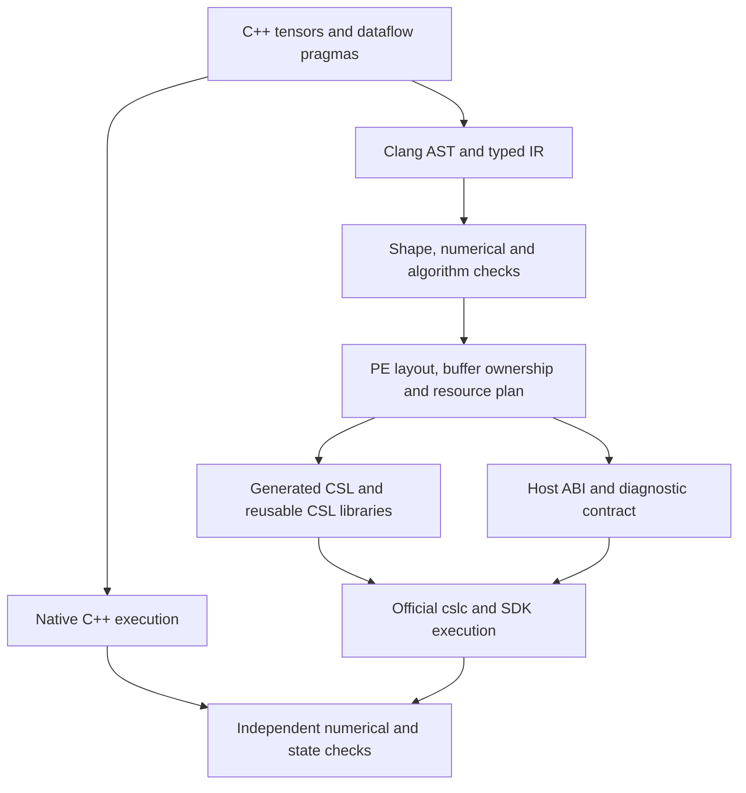

# Architecture

Pragma expresses supported numerical programs as restricted C++ with explicit spatial dataflow policies. It is an enhancement layer over CSL and SDK 2.10.1.

## Implementation map

| Responsibility | Entry points under `ports/toolchain/` |
| --- | --- |
| Restricted C++ frontend and operator API | `frontend.py`, `include/` |
| Numerical semantics | `ir.py`, `binary16.py`, algorithm-specific verifiers/evaluators |
| Spatial mapping and supported composition | `planner.py`, `mesh_*.py`, resource and shape contracts |
| CSL math and communication | `runtime/` |
| Build snapshots and native execution | `compile.py`, `integrity.py` |
| SDK transport and tensor packing | `sdk.py`, algorithm-specific SDK adapters |
| Inspection and qualification | `validate.py`, `debug.py`, `ports/experiments/` |

A logical matrix product may explicitly select SUMMA, Cannon, half two-hop or grouped reduction. This is a finite set of supported lowerings; arbitrary combinations, dynamic layouts and global resource allocation are not implemented. Unsupported combinations must fail rather than silently choose a different algorithm.

## Resource and ownership contracts

Colors, input/output queues, local tasks, microthreads and DSR banks are distinct resources. Their indices and live intervals are part of a lowering contract. Local send completion releases local ownership; receive completion establishes incoming-data readiness. Buffer reuse requires the appropriate joins. Queue-state observations alone are not a universal synchronization proof.

The library layer uses official collectives, DSD/DSR arithmetic, asynchronous routes and task callbacks. Synchronous local kernels can be reused when the caller provides the specified scratch space and resource leases. Layout/route ownership must also be reconciled before two regions can compose.

Host ABI correctness matters: stable exported input pointers must remain separate from rotating working pointers. Historical Cannon warm-call failures and attention descriptor-stride failures motivated explicit contracts and regression witnesses.

## Numerical semantics

The default scalar path is f32; half paths explicitly use `spatial::f16` and a Clang `_Float16` native reference. `fp=relaxed` permits the declared spatial accumulation order, not arbitrary error. Target-bit checks reconstruct device arithmetic, while independent mathematical checks bound error against the original inputs.

SDK half math can differ from rounding a host math function to half. The project retains observed SDK math witnesses. Mixed precision is explicit: blocked half partial sums with f32 merging are not equivalent to an all-f32 dot product.

## Composition and scope

Supported resident compositions include normalized projections, supplied-Q/K/V attention, gated MLP and a bounded projection/residual/RMS graph. Intermediate device tensors stay resident in those qualified graphs. These do not establish a complete transformer layer or model.

See [pragma syntax](../ports/docs/PRAGMAS.md), [DSR leases](../ports/docs/INFERENCE-DSR-LEASES.md), [numerical policy](../ports/docs/NUMERICAL-POLICY.md) and [the validation policy](VALIDATION.md). Detailed algorithm documents preserve dated measurements; the release status defines the snapshot boundary.
