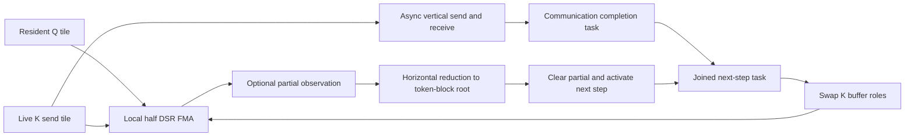

# QK transpose: measured source schedule and lowering requirements

This is the next numerical stage after the qualified RMS/projection fan-out. The source investigation below is preserved chronologically; subsequent bounded HLS qualification is recorded at the end. Full model inference is not qualified.

The pinned MeshInfra/WaferLLM source commit is `fd1c2daae37cd68706c03fc8009887ecee9900f8`. `score_matmul`, `matmul_T_compute`, and `matmul_T_reduce_add_x` compute QKᵀ using a different schedule from the ordinary two-hop GEMM. The pin includes its existing WSE3 adaptations. The isolated wrapper removes unrelated public exports, enters score directly, observes partials, and returns through SDK command-stream completion. Arithmetic and communication bodies are retained.

For Q,K shaped M×N on P×P PEs, each PE stores a column-major Mt×Nt tile, Mt=M/P and Nt=N/P. Q stays local. K rotates vertically through the two-hop cycle. Each PE forms an Mt×Mt local product over its Nt features. A horizontal reduction combines these products into the score block owned by that round's root. Every row visits every output root exactly once.

For cycle `[0,2,4,6,7,5,3,1]`, round r at row y owns K token block `cycle[(position(y)-r) mod P]`. The reduction root is the same block number. No host-side K transpose or initial block permutation is needed. The output tile at `[y,x]` contains score token rows y and columns x.

At a middle root, actual device results use **own partial plus the eastern chain, then the western chain**, rounding each addition to half. On the random64×128 probe this order gives zero mismatches; reversing the two chains changes870 output half words. Both identity/permutation and zero cases are insensitive to that order, so neither is sufficient alone. All unreduced partials match the independent sequential half-FMA model. Independent math.fsum QKᵀ relative L2 error is0.000725245 in the random case. The three calls share one SDK runtime and reload changed inputs.

The CSL lifecycle must survive lowering:

- Q remains immutable; K has separate stable host handles and working send/receive roles. Do not infer the live buffer from its variable name after swaps.
- Vertical receive/send use explicit UT2/UT3. The score path does not issue horizontal matrix exchange; it explicitly opens the otherwise two-axis join gate.
- Tasks20,25,26 join vertical completion with completed local compute/reduction before the next swap. Source task19 remains a declared resource; it is not evidence of active left traffic in this phase.
- Local FMA and synchronous horizontal reduction reuse DSR1 only across a sequencing boundary. The reduction also uses DSR2. Vertical async transfer has separate communication DSR ownership.
- The next backend must model these phases, queue/color ownership and memory costs explicitly. Do not map this graph to ordinary GEMM simply because its final equation is a matmul.

The natural frontend graph is a typed transpose view feeding matmul, with an explicit spatial reduction policy. A view must not imply a host materialization or a global physical transpose. Half transpose/type support, semantic matching, shared planner/runtime lowering, stable transport, repeated-call diagnostics, source controls and mutations must all be integrated before this stage enters the qualified catalog. RoPE, scaling, masking, softmax and probability×V composition remain separate contracts.

Reproduce the source experiment from `ports` with `python3 experiments/score_matmul_source_probe.py --prepare` (or `--large`), copy the new frozen directory to the SDK host, and execute its frozen `driver.py --execute DIRECTORY`. Analyze completed results using `experiments/analyze_score_matmul_source.py PROBE NEW_REPORT`. Preserve failed runs and do not alter a running bundle. Small evidence is `evidence/score-matmul-source-20260907T015139514873Z`; large128×256 probe is `evidence/score-matmul-source-20260907T015514560259Z`.

## Larger source validation

128×256/P8 completes all three SDK calls. All partials and EAST-first reduction bits match; the random standard relative L2 is0.000959738 and peak-scaled error0.001321365. WEST-first differs in3390half words. The measured maximum local interval is39286cycles. Both final dependency-hashed reviews are `score-small-dependencies-verified.json` and `score-large-dependencies-verified.json` under evidence. These remain source-only results; no HLS score registration has occurred.

## Implemented HLS path under SDK qualification

`mesh_score.v1` now matches the typed right-transpose/matmul graph and emits the source-derived CSL runtime using the shared communication library. The new pragma policy is `exchange=vertical_two_hop reduce=rotating_root order=east_first overlap=double_buffer compute=dsr fp=relaxed`, with explicit rows/cols. C++ transpose preserves the element type; only its logical shape survives into the target schedule. Input K is copied once to private rotating buffers so its public HLS input remains immutable. This copy is included in timed source comparisons.

Small64×128 and large128×256 sampled six-call bundles and a small counter control are currently executing. These are development profiles until frozen final audits, coherent-corruption tests, independent actual C++/device mathematical checks and controls pass. `score_debug.py` exposes each round's K token owner and reduction root, and returns unavailable for incomplete future epochs.

## Qualified bounded HLS stages (2026-09-07)

Score64×128 and128×256/P8 each pass six SDK calls,35 mutation rejections, exact source-order internal state and independent original-input accuracy. Qualification indices021757505163 and023537815657 retain the full evidence. Counter64×128 costs12081/11975 source cycles (~0.885% overhead); sampled larger source comparison includes additional K-owner observation.

Resident score→softmax64×128 and128×256/P8 also qualify after six calls and48 mutations each. Local math uses `runtime/softmax_local.csl`, SDK `@map` exp, and sequential DSR ownership. Completed score partial storage becomes exponents only after all root reductions finish. Maximum initialization is explicitly repaired relative to the pinned source. Counter small16516/17531 cycles; sampled large54924/59708 cycles. The latter includes unequal observers. No intermediate host transfer, new color or task allocation is introduced by normalization.

Probability×V is the next stage; its device-layout contract and qualification are described in DEVICE-ALIGNED-MATMUL.md. Combining these stages remains a separate runtime-lifecycle qualification. Masking, multiple heads, KV cache, positional semantics and complete model inference are outside these bounded results.
