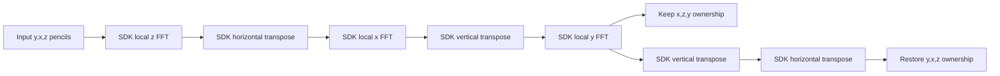

# SDK-native distributed complex FFT

The high-level operation is a full cubic C2C transform with explicit direction and normalization. The storage ABI is interleaved f32 real/imaginary values, logical `[y,x,z,component]`; `tensor<N*N,2*N>` represents that shape. A pencil policy selects a square PE region, native SDK local FFTs and distributed transpose communication.

```cpp
#pragma csl dataflow rows=4 cols=4 partition=pencils exchange=sdk_transpose compute=sdk_fft result=input_layout fp=relaxed
auto spectrum=spatial::fft3d<16,spatial::fft_direction::forward,spatial::fft_norm::backward>(x);
```

This is a bounded library lowering, not a general FFT planner. It currently rejects half precision, non-cubic/non-power-of-two shapes, tails, arbitrary roots and concurrent region composition. The C++ numerical reference uses double-intermediate radix-2 transforms and returns f32. NumPy's independent FFT defines the original-domain accuracy screen; native/device bit identity is not required.

## Spatial schedule



Both output paths have the same numerical transform. The chosen ownership is explicit in the typed schedule. A host permutation can present logical axes; a resident consumer would need to accept that physical layout explicitly.

## SDK facilities and source contract

The default counter-only, input-layout PE imports `<kernels/fft/fft3d>` directly. Sampled execution and the optional transposed-output policy use a small source-derived controller adapter. SDK butterfly arithmetic, DSD/DSR instructions, local pencil gather/scatter and transpose tasks/routes are unchanged. The wrapper adapts the official `fft3d_rpc` entry/completion interface for a compile-time direction and normalization. The layout uses SDK `get_params` boundary roles and official memcpy parameters.

Actual SDK2.10.1 source executes local z FFT, horizontal transpose, local x FFT, vertical transpose, local y FFT, vertical transpose, horizontal transpose. The last two transposes restore the input pencil ownership without additional FFTs. `transpose_start` arguments are `vertical,next_vertical`; the second boolean is assigned to next_vertical_mode but is not read in this pinned SDK module. Actual route orientation is reset at each transpose_start by initialize_filters using vertical_mode. Public documentation's description of three transposes must not override this implementation.

Each PE owns `T*T` pencils of lengthN, whereT=N/P. The scalar offset is `2*(z*T*T+(y%T)*T+x%T)+component`. Positive-sine twiddles follow the pinned SDK benchmark. SDK normalization enum is backward0/ortho1/forward2; direction is forward0/inverse1. The 3D layout uses f16=0/f32=1, unlike an older README description.

Host X is a stable exported pointer. The SDK supports the in-place X/X call used by its own RPC wrapper; its output argument is currently unused. X, N-element auxiliary storage and library workspaces live for the entire async call. A completed callback resets the private transpose counter. The next host launch and buffer reuse must follow that callback; aborting a call does not provide a warm-recovery contract and requires runtime recreation.

Resources include colors4–7, input queues2/4, output queues3/5, local tasks11–13, microthreads2/3, DSR1–3 in applicable banks, XDSR0 and scalar registers0–2. SRAM planning includes both the input/output array and the same-sized SDK transpose workspace, FFT/twiddle/auxiliary buffers and a conservative code/stack reserve. Linked ELF allocation must still be checked after compilation; reserve is not a stack measurement.

## Validation and observability

Six changed-input calls use signed random complex data, a displaced complex impulse, exact zero reset, complex constant, a positive complex wave with distinct y/x/z frequencies1/2/3, and cancellation across opposite corners. Direction and all three normalization modes require their own SDK evidence, followed by a paired device forward/inverse reconstruction.

The public SDK interface offers a final callback, not internal phase hooks. Counter-only execution observes final packed results, entry/completion counts, owned-queue empty masks and total local elapsed timestamps; `internal_phases_observed=false` remains explicit for that mode. `debug.py --node p1_2 --step 3` selects a final local pencil and maps it to logical coordinates; it does not fabricate transpose history.

The fixed accuracy screen requires relative L2 error<=2e-5 and max error<=3e-5 times the original reference peak. Zero transforms require exact zero. Runtime completion, numerical accuracy, internal-stage coverage, simulator local-interval performance and hardware performance are separate evidence levels.

Initial compiler failure `190911521275` is preserved: textual boolean `inverse:false` in `--params` caused a compiler APInt assertion. The adapter now transports an integer direction flag. No numerical tolerance or fixture was changed to resolve this interface failure.

SDK reference files and exact SIF/source hashes are preserved read-only in `references/sdk-fft-2.10.1/PROVENANCE.json`. They are review material, not a redistribution license grant. Qualified bundles and matched controls are listed below; larger and distinct-layout followups remain separate evidence.

## Optional sampled driver adapter

`--instrumentation sampled` selects a local diagnostic adapter of the SDK fft3d control driver. The restored-layout path adds seven observer calls; local FFT and transpose implementations remain SDK imports. The optional transposed-output path stops after stage five and is separately qualified. Each observer records the first/last complex value of every local pencil and an epoch-local phase count. The independent phase oracle applies local-axis transforms and source-derived axis swaps. Coverage is pencil endpoints, not full intermediate tensors. Lean mode continues to import the public driver without phase observation.

The real16³ and32³ forward runs `191005684402` and `191335872730` pass six calls with internal observation explicitly absent. The16³ original-layout/RPC control `191255216720` gives bit-identical outputs on two calls. All six direction/normalization combinations at16³ have passed six changed-input SDK calls. The sampled16³ inverse roundtrip and sampled32³ forward transform have also passed; the latter records172,032 f32 pencil-endpoint values. The64³ sampled run has passed four changed-input calls on256PEs, with458,752 stage endpoint values and independent directDFT review. Matched32³ instrumentation control passes all six calls with identical packed output bits:224046sampled versus218061counter maximum-local cycles (2.7446% sampling overhead). Source-native32/64 comparisons now pass two bit-identical changed calls each.32³ counters HLS/native max-local218061/224394;64³ sampled519498/519341 (0.0302%overhead). These include differing wrapper instrumentation and compile-time versus RPC flags; no isolated optimizer attribution. No per-component accuracy guarantee is implied by the normwise screen.

A device-to-native roundtrip exposed valid f32 subnormals rejected by the original C++ stream parser. The native harness now parses double, checks the finite input bound, then converts to f32. The device values are retained unchanged. Native stderr and compiler command/log files are preserved on future failures. External compiler flags use integer layout parameters and explicit internal boolean conversion.

## Direction and normalization

| Norm | Forward scale | Inverse scale |
| --- | --- | --- |
| backward | 1 | 1/N³ |
| ortho | 1/N^(3/2) | 1/N^(3/2) |
| forward | 1/N³ | 1 |

The norm is numerical semantics in the typed call, separate from the placement pragma. Directions and normalizations are checked independently; a forward/inverse pair alone would not detect reciprocal scale mistakes.

Device roundtrip `192237389726` consumes the exact six outputs from forward `191005684402`. Maximum original-input relative L2 reconstruction error is1.7993603e-7. All seven sampled stages pass,43,008 internal f32 endpoint observations; maximum sampled absolute difference from the phase oracle3.8146973e-6. Twelve adversarial result/protocol/phase mutations are rejected in `fft-audit-mutations-20260906T192731981036Z.json`. See `fft16-device-roundtrip-result.json` and the reusable `experiments/check_fft_roundtrip.py`. These are local simulator results.

### Dynamic route ownership

The public driver accepts four color slots4–7, which this lowering conservatively reserves. The actual transpose module uses the first two (4/5) for opposing streams, including SWITCH_ADV control wavelets and TEARDOWN handlers. Its initialize_filters resets routes from the current vertical_mode on each call; next_vertical_mode is assigned but unused in the pinned source. These colors and their queue/handler state remain exclusively owned through completion of the selected transpose schedule; another region operation may not interleave on them merely because a transient queue snapshot is empty. Internal control payloads have not been individually traced in the current sampled evidence.

The FFT input-magnitude bound is independent of signed16-bit descriptor extents. It may be an integer up to2³¹−1 under this bounded N≤64 profile; all inputs remain finite f32. This admits large unnormalized spectra as inverse inputs (a64³ unit wave has peak262144). Authoring derives a sufficient bound from supplied data instead of imposing32767 on spectral values. Address, descriptor and SRAM limits remain separately checked.

## Qualified transposed output at32³

`result=transposed_pencils` declares physical axes `[x,z,y]` after three local FFTs and two distributed transposes. The host performs only a permutation to present logical `[y,x,z]`; it performs no transform or normalization. This removes the two final ownership-restoring transposes. The controller resets its private count before completion so a subsequent call can start with fresh input ownership. Six changed-input calls in one runtime validate this warm-entry path for the qualified32³/8x8 case.

The32³ bundle `195708248348` passes six SDK calls and122,880 sampled f32 endpoint values across five stages. A raw uint32 permutation proves every logical device output bit matches restored bundle192436731723, including sign-zero handling. Maximum-local cycles224046→202532, a9.60% reduction (restored/transposed1.10623), under matched sampled instrumentation. This includes observation costs, excludes host gathering, and is not global or hardware latency. Linked static high-water20928bytes. A future resident consumer must accept the declared output ownership; transposed-input composition is not currently supported. See [design references](FFT-DESIGN-REFERENCES.md).

The application runner now checks the actual C++ stdout separately from the IR reference. Textual floating results are decoded back to binary32, as specified by the native harness, before exact fixture comparisons. Preserved run201844813894 exposed decimal-as-f64 comparison failures; the repair changes decoding only. See `evidence/native-decimal-f32-decoding-failure.json`; fresh full79catalog regression202157697783 passes actual C++ stdout checks.

The historical transposed qualification has a generic “seven-stage” phrase in its free-text contract; its schedule and checks correctly use five stages and require the two omitted phase counters to remain zero. Future reports use schedule-dependent wording. Frozen historical reports remain unchanged.

## Registration checkpoint

Ten bounded FFT profiles are registered in qualification205519409769, bringing the catalog to89. The index rechecks frozen device audits and actual C++ stdout with an independent directDFT.16³ covers both directions and all three normalizations;32³ covers sampled/counter forward, transposed output and device-output inverse reconstruction;64³ covers four sampled forward calls on256PEs.32³ roundtrip maxrelativeL2 is2.800908279e-7. Source-overhead controls cover forward/backward normalization at16/32/64; other modes have measured intervals without their own source-overhead control. This closes the bounded SDK FFT family, not arbitrary FFT planning, transposed-input composition, full wsFFT/SlideFFT reproduction or hardware performance.

Reproduction and precise selection commands are in [FFT-REPRODUCTION.md](FFT-REPRODUCTION.md).
