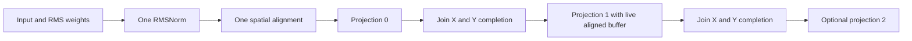

# Resident normalization and projection fan-out

The frontend expresses one `rmsnorm(x, weight, epsilon)` and two or three
`matmul(normalized, projection_weight)` operations with named outputs. Each
operation retains its existing dataflow policy. The new lowering recognizes
the actual shared SSA producer, verifies every branch using the existing
single-projection verifier, and builds one resource schedule. It is a bounded
composition, not arbitrary graph fusion or complete Transformer inference.

Branches occupy the same PE region and execute sequentially. Each projection
still overlaps its own two-hop fabric traffic with local DSR/map computation.
Normalization, alignment and communication scratch are shared. The current
compiler does not claim to run these branches concurrently on disjoint regions.

## The source failure that defines the transition

The original isolated Prefill RMS→Q/K/V continuation executes successfully,
but K and V each differ in4096of8192half outputs on64×128/8×8; Q is exact.
Actual snapshots show that after pre-shift and all P communication rounds,
the latest aligned input resides in different physical double-buffer slots
on different PE rows. Resetting the next operation to named normalized/scratch
addresses loses ownership on32PEs.

The corrected continuation preserves the completed live and previous pointers.
Before calling the existing matmul entry, it exchanges those roles; matmul's
entry swap then restores the correct live send owner. No additional tensor
copy or alignment traffic is introduced. Two changed source calls show:

- Original live-owner mismatches by Q/K/V boundary:0/32/32PEs.
- Corrected live-owner mismatches:0/0/0PEs.
- Corrected Q/K/V outputs all match scheduled half arithmetic exactly and pass
  independent standard RMS/matmul checks.

Evidence: `resident-rms-qkv-source-analysis.json` preserves failure;
`qkv-live-buffer-ownership-review.json` checks ownership separately;
`resident-rms-qkv-ownership-repaired-analysis.json` checks numerical results.
The source patch is an explicit correction to the tested continuation, not an
unmodified-source or full-model qualification claim.

## CSL storage and resources

The runtime parameterizes projection count. Weights occupy independent slices
of one host-visible slab; outputs occupy independent slices of another slab.
The SDK host packs those slices per PE and exports stable base pointers.
Element-address expressions produce `*f16`; communication pointers require
`[*]f16`, so slice entry addresses use explicit CSL `@ptrcast`. The first
invalid generated-pointer build is preserved, and all subsequent executions
use fresh bundles.

Colors1–11, input/output queues3–7, microthreads0–3 and local tasks19/20/25/26
are shared across the sequential stages. Existing compute/communication DSR
ownership and X/Y completion joins remain intact. Increasing projection count
does not allocate more colors or asynchronous engines.

Memory accounting includes every independent weight/output slice, shared
normalization/communication storage and all requested observations. Sampled
mode saves the normalized tensor, every branch's P contraction prefixes and
the completed live buffer at each branch boundary. Counter mode keeps final
results, initial weight transport, completion epochs, queue-drain witnesses
and timestamps, but no internal tensor observation. Three128×256 projections
with full sampling exceed the48KiB budget and are rejected; counter mode fits
the conservative static allocation estimate. Linked ELF and execution checks
remain separate gates from this estimate.

## Validation and debugger

Six native/device fixtures include zero input, tiny values, changed RMS weights
and a final call with independently generated dense weights for every branch.
The first two also match the original-source controls. Each output has its
own exact target-half and independent standard normwise check (relative L2≤1.5%,
maximum error≤2%of reference peak, exact zero required for a zero reference).
These are bounded test qualifications, not a per-component or all-input BLAS
accuracy guarantee.

Debugger step0 is normalization; subsequent steps identify branch, completed
round count, consumed logical K blocks and prefix bits. At branch completion
it also exposes the live aligned-buffer witness. Counter stages are marked
unobserved rather than synthesized into apparent measurements.

At initial integration the64×128/8×8 three-projection sampled,
64×128/4×4 two-projection sampled and128×256/8×8 three-projection counter
configurations are executing. None is yet registered as SDK-qualified HLS.
Source experiments do not substitute for these generated-CSL gates.

## Inspecting a running bundle

`toolchain/debug.py BUNDLE --check-completed --node p0_1 --epoch 0 --step 16`
checks completed call records and inspects a selected branch boundary. It first
invokes the bundle's frozen integrity checker in an isolated process, then
records the current diagnostic implementation and exact results-file hashes.
The result explicitly sets `diagnostic_is_full_qualification=false`.
Future epochs report unavailable instead of producing an index error.

New runtime snapshots publish results by atomic replacement, validate each
completed call before continuing and retain the last completed-call diagnostic.
An error stops the batch with its partial results preserved. Full qualification
still requires all requested calls, runtime shutdown, frozen artifact checks
and the final auditor. Existing running snapshots are not modified to add this
feature. A live three-call review is preserved in
`fanout3-live-prefix-debug-20260907T0118Z.json`. The first attempt using current
implementation hashes against an older frozen run was rejected; no integrity
check was disabled.

## Executed qualification, 2026-09-07 01:55 UTC

Three profiles now pass six SDK calls and independent actual native/device math.fsum checks, including the final call with independent dense weights for each branch. See `../evidence/qualification-20260907T015033859804Z.json`. Sampled64×128/P8 has1,376,256 intermediate half observations. Static allocations are19536B (three/P8),31600B(two/P4),23216B(large three/counters); these are linked static sizes, not stack high-water marks.

The no-tensor-observer64×128/P8 three-branch control has48006/47933 and48012/47940 HLS/source maximum local cycles, about0.15% overhead. All three outputs are bit-exact. Source carries explicit RMS and live-owner repairs. Larger geometry has correctness evidence but no matching source-performance comparison; do not generalize the small control or call this full attention/hardware performance.
